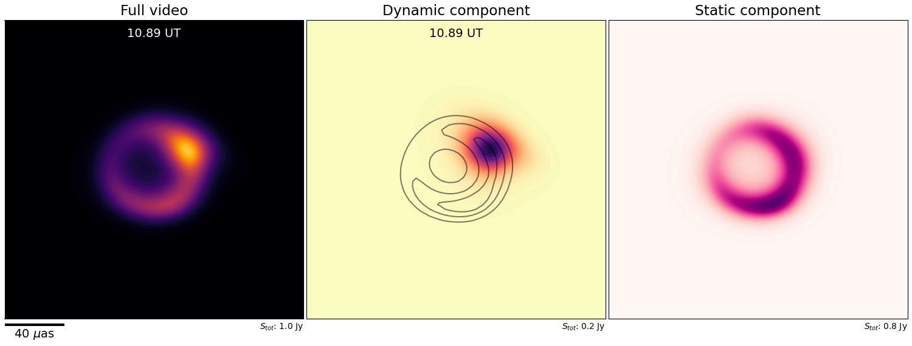
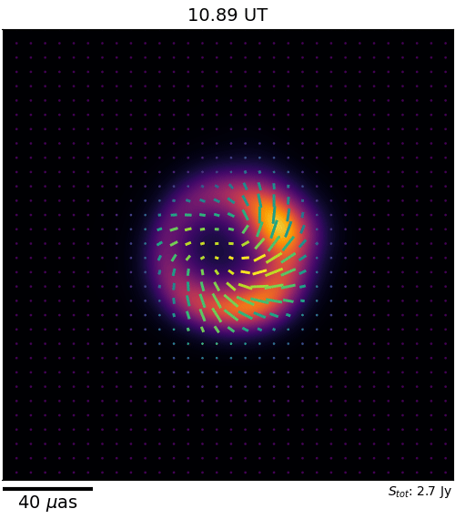

# kine

`kine` is a Python package for video reconstruction of variable and sparse radio-interferometric data, from horizon-scale supermassive black holes to relativistic jets and more. It models the time-dependent brightness distribution of the observed source through a fully unsupervised _Neural Field_, or coordinate-based neural network.

### Features

`kine` currently supports:
- Full polarimetric video and image reconstruction.
- Simultaneous static and dynamic video decomposition.
- Simultaneous fitting of complex telescope gains.
- GPU-based Non-Uniform Fast Fourier Transform (NUFFT) computations.

## Installation

`kine` relies on the `JAX` library for GPU computations and requires a careful installation of CUDA-related packages and others. For reference, a working conda environment can be found in [environment.yml](https://github.com/aefezeta/kine/tree/main/environment.yml). Detailed instructions on the installation will be provided in the near future.

Assuming you have all required dependencies already installed, then install `kine` from the root directory with:

    $ pip install -e .

## Documentation

Full documentation will be available soon.

Some (quite comprehensive) example scripts on how to use `kine` can be found in [examples/](https://github.com/aefezeta/kine/tree/main/examples). To run the code, simply execute the following from within the [examples/](https://github.com/aefezeta/kine/tree/main/examples) folder:

    $ python dynamic_imaging_example.py -obs ../data/dataset.uvfits -yml ./dynamic_imaging_params.yml

Or run the provided _bash_ wrapper. Diagnostic plots and results can be found as well in [examples/output/](https://github.com/aefezeta/kine/tree/main/examples/output).

  
   

## Developers

`kine` is developed and maintained by:
 - Antonio Fuentes (antoniofuentesfdez@gmail.com)
 - Marianna Foschi (foschimarianna@gmail.com)
 - Brandon Zhao (byzhao@caltech.edu)

 ## Citation

 If you use `kine` in your publication, please cite:
1. Foschi, M., Zhao, B., Fuentes, A. et al. "Video reconstruction of variable interferometric observations with neural fields." Under rev. (2026).
2. Fuentes, A., Foschi, M. et al. "Validation of horizon-scale Sagittarius A* video reconstructions with kine" In prep. (2026).